<div align="center">

# 🖥️ Windows Server & MCSA Infrastructure Lab

**Enterprise-Style Windows Server Infrastructure — Active Directory · DNS · DHCP · Group Policy · File Services**

`Windows Server 2016` · `Active Directory` · `DNS` · `DHCP` · `Group Policy` · `NIC Teaming` · `NTFS Permissions`

</div>

<br>

---

## 📦 Lab Environment Note

The complete VMware lab environment for this project is approximately **18 GB** in size, containing virtual disk files, snapshots, and VMware-specific configuration data.

To keep this repository lightweight and GitHub-friendly, the full virtual machine image is **not included**. Instead, this repository is built around comprehensive documentation and **30 detailed verification screenshots** covering the complete server-side configuration and client-side validation of the infrastructure.

This is an intentional design choice, not a limitation — the goal is to provide complete visual evidence of a working, hands-on infrastructure deployment without requiring reviewers to download or run the virtual machine themselves.

> 📁 This repository documents the configuration and verification of the lab. It does not contain the VMware `.vmx`/virtual disk files.

---

## 📌 Project Overview

**Windows Server & MCSA Infrastructure Lab** is a hands-on Windows Server infrastructure project designed to demonstrate practical **MCSA / System Administration** skills in a simulated enterprise environment.

Built on **VMware Workstation**, the lab deploys **Windows Server 2016 Standard Evaluation** as a domain controller and configures a complete set of core infrastructure services:

- Active Directory Domain Services
- DNS Server
- DHCP Server
- Group Policy Management
- File Sharing and NTFS Permissions
- Printer Deployment
- NIC Teaming
- A domain-joined Windows client

The Active Directory domain used throughout this lab is **`MR.com`**, hosted on the domain controller **`MANS-Server1`**, with a Windows client joined to the domain as **`PC1.MR.com`**. Every stage of the deployment — from server roles to client-side policy enforcement — is verified with real screenshots taken directly from the running lab.

---

## 🏗️ Lab Environment

| Component | Configuration |
|---|---|
| **Server Name** | `MANS-Server1` |
| **Operating System** | Windows Server 2016 Standard Evaluation |
| **Domain** | `MR.com` |
| **Client** | `PC1` |
| **Client FQDN** | `PC1.MR.com` |
| **DHCP Network** | `10.0.0.0/24` |
| **DHCP Address Pool** | `10.0.0.50 – 10.0.0.150` |
| **DHCP DNS Server** | `10.0.0.10` |
| **DNS Domain** | `MR.com` |
| **Server Gateway** | `192.168.1.1` |
| **NIC Team Name** | `NIC` |
| **NIC Teaming Mode** | Switch Independent |
| **Load Balancing** | Address Hash |

---

## 🧩 Core Infrastructure

### 1. Windows Server

Windows Server 2016 Standard Evaluation was installed and configured as the foundation of the lab, hosting Active Directory, DNS, DHCP, and File Services roles.

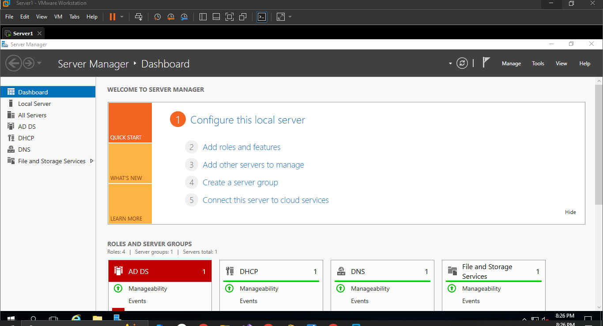

The Server Manager dashboard confirms all installed roles and their operational status.

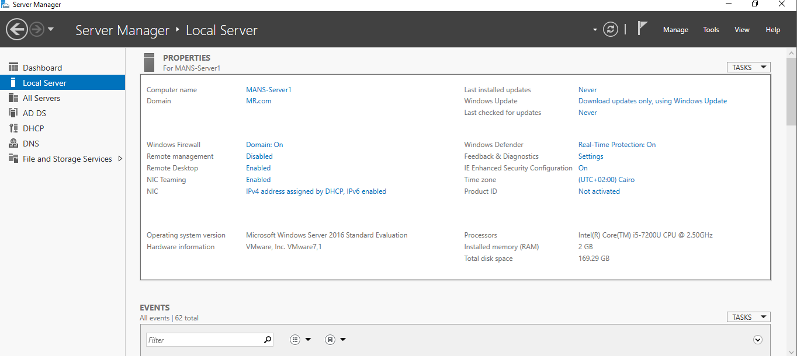

The Local Server overview verifies core server properties, including computer name and domain membership.

---

### 2. Active Directory Domain Services

Active Directory Domain Services (AD DS) was installed and promoted to establish the **`MR.com`** domain, providing centralized identity and resource management for the lab.

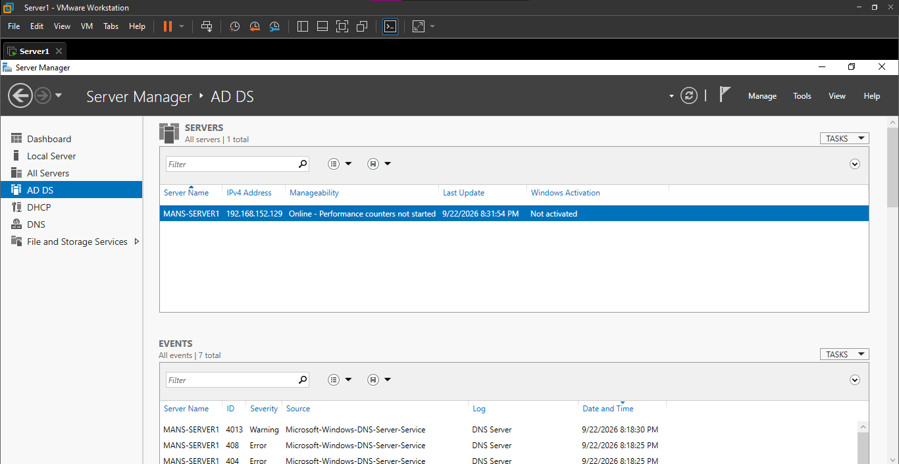

The AD DS role overview provides visual evidence of the Active Directory Domain Services environment configured on MANS-Server1.

**Organizational Units:**

- `HR-2026`
- `IT-2026`
- `Sales-2026`

Active Directory Users and Computers was used to manage users, security groups, organizational units, domain controllers, and computer objects across the domain.

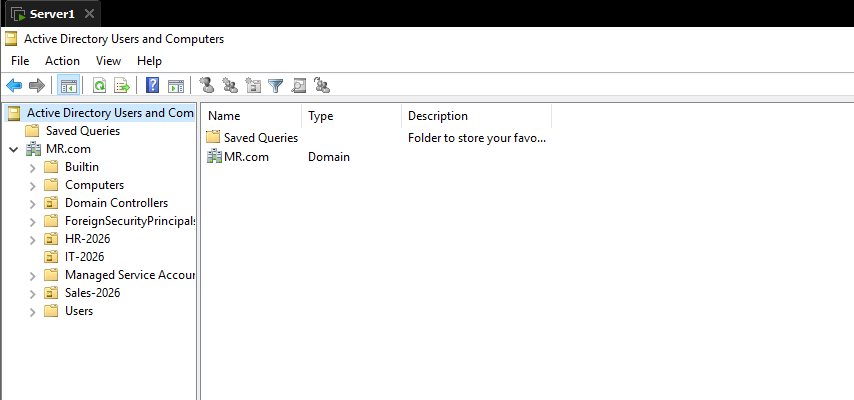

The `IT-2026` organizational unit contains the following objects:

- `IT-group` (security group)
- `IT1` (user)
- `IT2` (user)

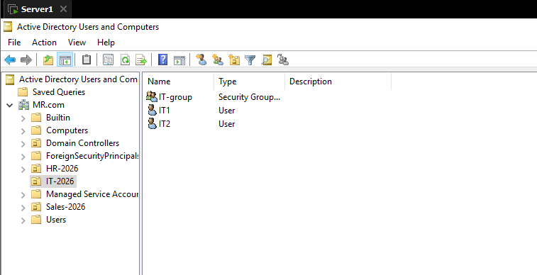

This screenshot verifies the users and security groups configured within the IT organizational unit.

---

### 3. DNS Server

The DNS Server role provides name resolution for the `MR.com` domain, resolving both server and client hostnames.

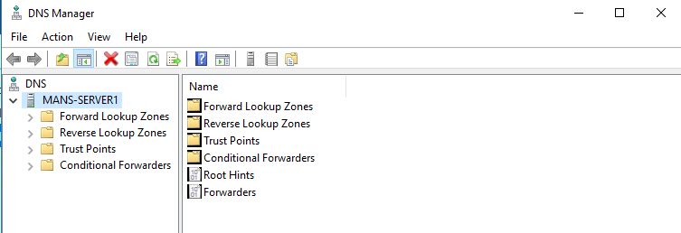

The DNS Manager overview confirms the DNS Server role is installed and running on `MANS-Server1`.

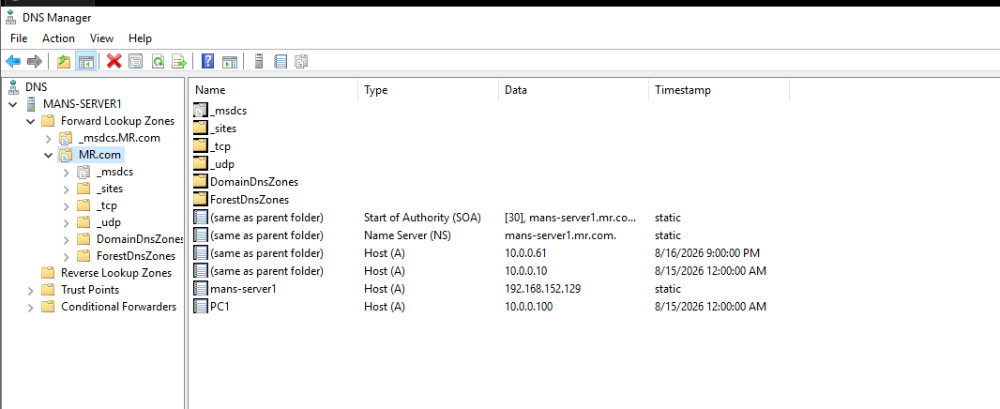

The Forward Lookup Zone for `MR.com` contains host records for `mans-server1` and `PC1`, verifying that both the server and the domain-joined client are correctly registered in DNS.

---

### 4. DHCP Server

The DHCP Server role automatically assigns IP configuration to clients on the `10.0.0.0/24` network.

**DHCP Scope:** `10.0.0.0/24`
**Address Pool:** `10.0.0.50 – 10.0.0.150`
**Exclusion Range:** `10.0.0.50 – 10.0.0.60`

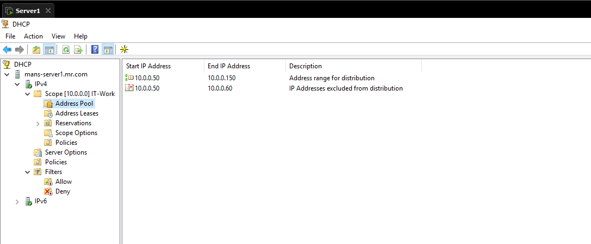

The DHCP Server overview shows the configured scope and its operational status.

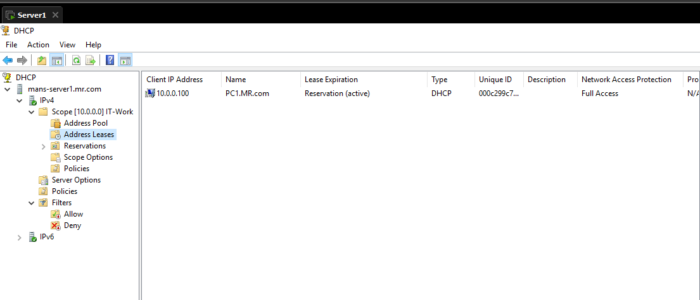

Active address leases confirm that the client `PC1.MR.com` received the address `10.0.0.100` from the DHCP scope.

**DHCP Scope Options:**

| Option | Value |
|---|---|
| Router | `192.168.1.1` |
| DNS Server | `10.0.0.10` |
| DNS Domain | `MR.com` |

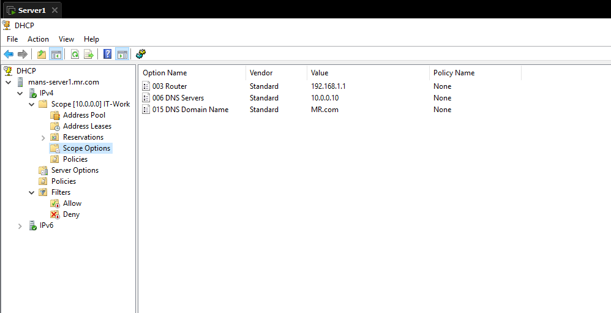

This screenshot verifies the scope options distributed to DHCP clients, including default gateway, DNS server, and DNS domain name.

---

### 5. Group Policy

Group Policy was used to centrally manage client configuration and enforce consistent user experience across the domain.

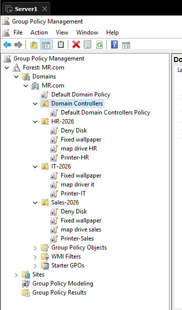

The Group Policy Management console shows the policies configured for this lab, linked to their respective organizational units.

**Policies demonstrated:**

**Fixed Wallpaper** — enforces a standardized desktop wallpaper across domain-joined clients.

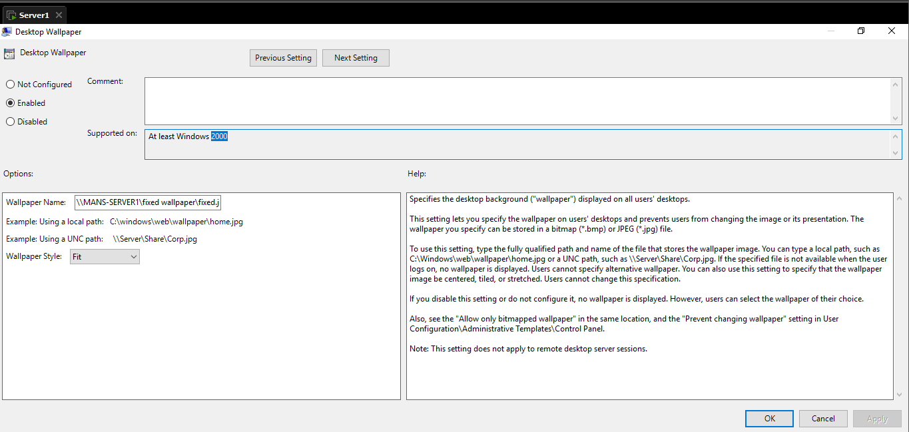

**Map Drive (HR)** — automatically maps a network drive for users in the HR organizational unit.

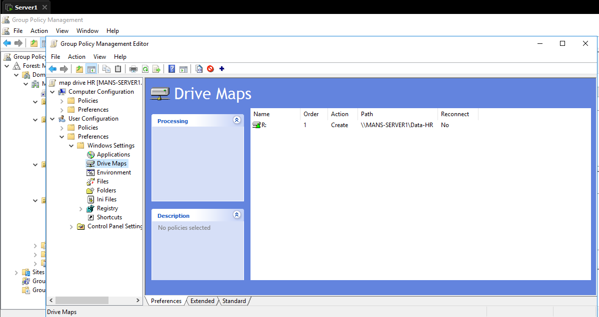

**Removable Disk Write Access Restriction** — restricts write access to removable storage devices for security purposes.

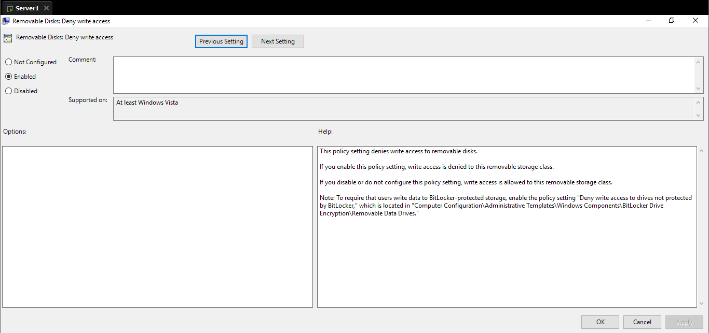

**HR Printer Deployment** — deploys a shared printer to users in the HR organizational unit.

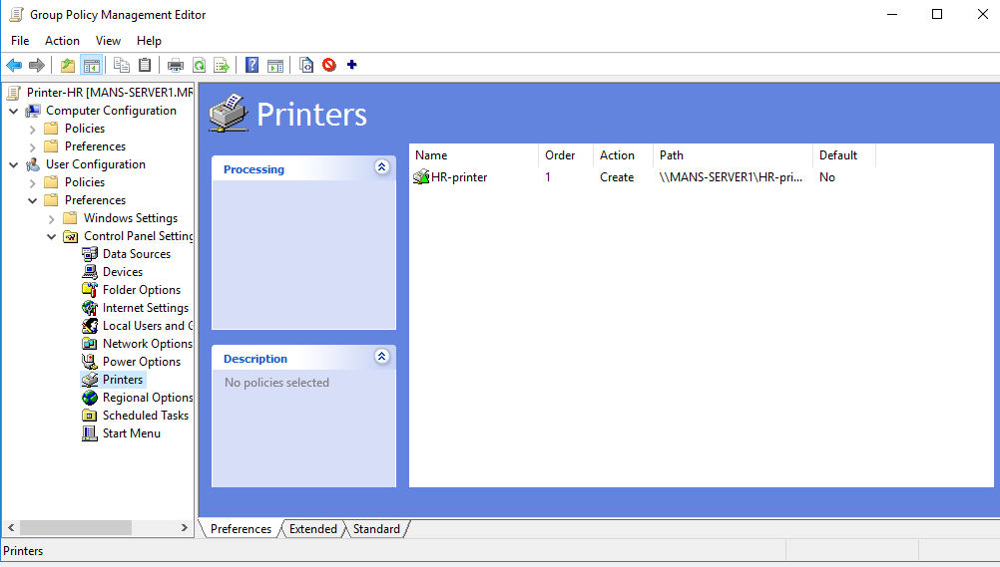

**IT Printer Deployment** — deploys a shared printer to users in the IT organizational unit.

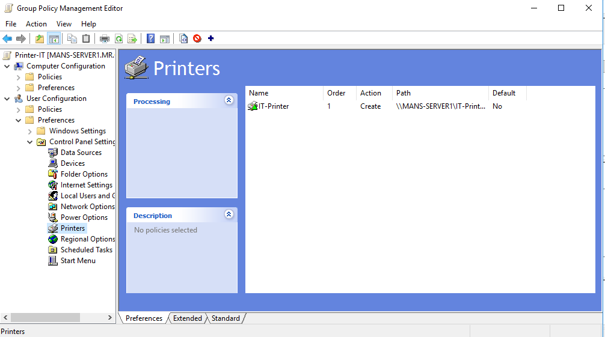

**Sales Printer Deployment** — deploys a shared printer to users in the Sales organizational unit.

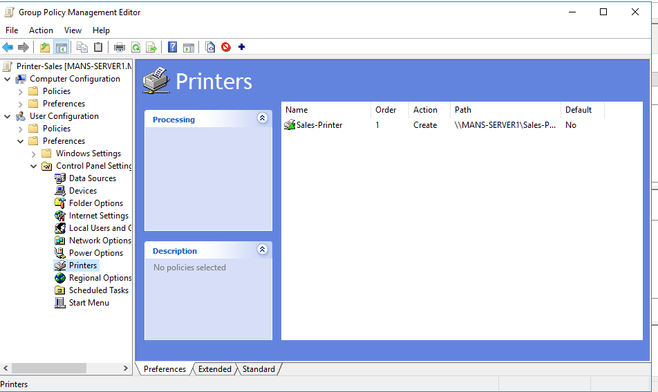

---

### 6. NIC Teaming

NIC Teaming was configured on `MANS-Server1` to provide network redundancy and load distribution across multiple network adapters.

| Property | Value |
|---|---|
| Team Name | `NIC` |
| Adapters | `Ethernet 1`, `Ethernet 2` |
| Teaming Mode | Switch Independent |
| Load Balancing | Address Hash |
| Adapter Status | Both active |

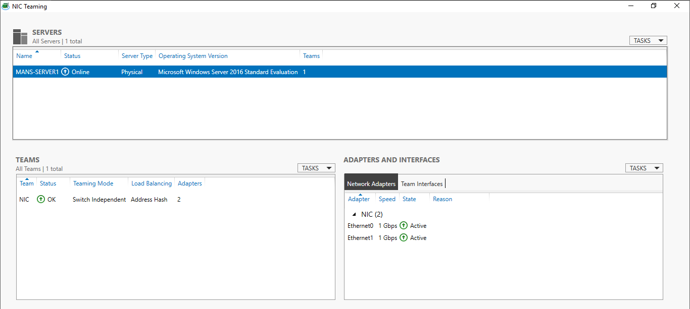

This screenshot confirms the NIC team `NIC` is active, with both `Ethernet 1` and `Ethernet 2` adapters participating using Switch Independent teaming and Address Hash load balancing.

---

### 7. Domain-Joined Client

The Windows client **`PC1`** was joined to the **`MR.com`** domain, becoming manageable through Active Directory and Group Policy.

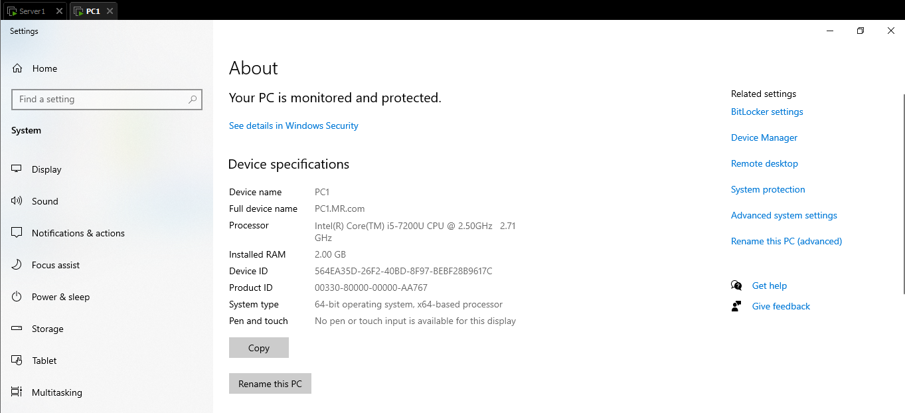

This screenshot verifies that the client's full computer name is `PC1.MR.com` and that it is a member of the `MR.com` domain.

---

## 🌐 Client Network Configuration

The client `PC1` receives its full network configuration automatically via DHCP.

| Parameter | Value |
|---|---|
| DHCP | Enabled |
| IPv4 Address | `10.0.0.61` |
| Subnet Mask | `255.0.0.0` |
| Default Gateway | `192.168.1.1` |
| DHCP Server | `10.0.0.10` |
| DNS Server | `10.0.0.10` |
| DNS Domain | `MR.com` |

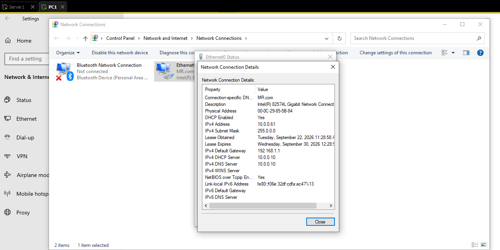

This screenshot displays the client's IP configuration output, confirming that DHCP-assigned addressing and DNS settings match the server-side configuration.

---

## 🔍 DNS Verification

DNS resolution for the `MR.com` domain was tested from the client using `nslookup`.

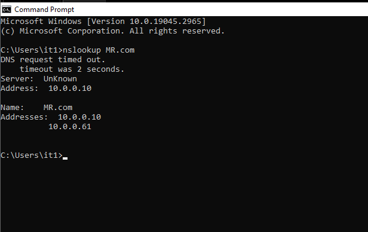

> ℹ️ The screenshot shows the `nslookup` output as captured, including a reported timeout during resolution. This result is presented as-is; it is not being represented as a fully clean resolution, and reflects the actual behavior observed during testing in this lab environment.

---

## ✅ Client-Side Group Policy Verification

Applied Group Policy settings were verified from the client using `gpresult`.

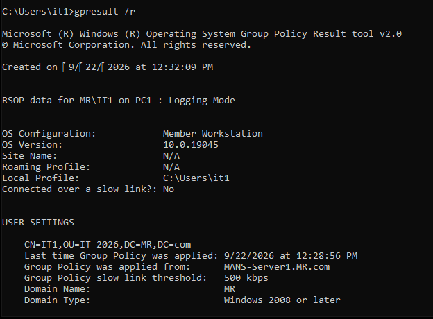

This screenshot shows the user-level settings applied to the logged-on client session.

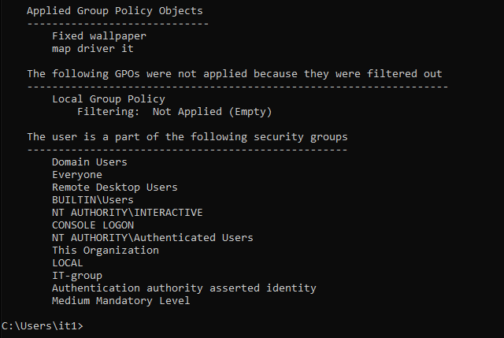

The applied policies list confirms that policies including the **fixed wallpaper** policy and the **IT drive mapping** policy were successfully applied to the client. Where visible in the screenshots, the applied policies are associated with the `IT1` user account and the `IT-group` security group.

---

## 💾 Mapped Drive Verification

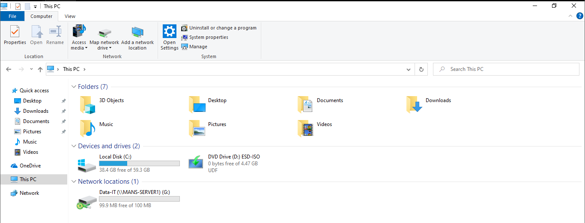

This screenshot confirms that the network share **`Data-IT`** is successfully mapped as drive **`G:`** on the client, reflecting the Group Policy drive mapping configured on `MANS-Server1`.

---

## 🖼️ Wallpaper Verification

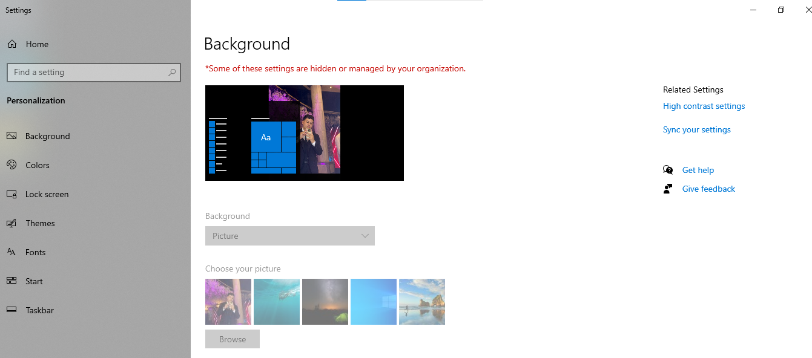

This screenshot shows the client desktop reflecting the organization-managed wallpaper, confirming that the fixed wallpaper Group Policy is actively enforced.

---

## 🖨️ Printer Deployment Verification

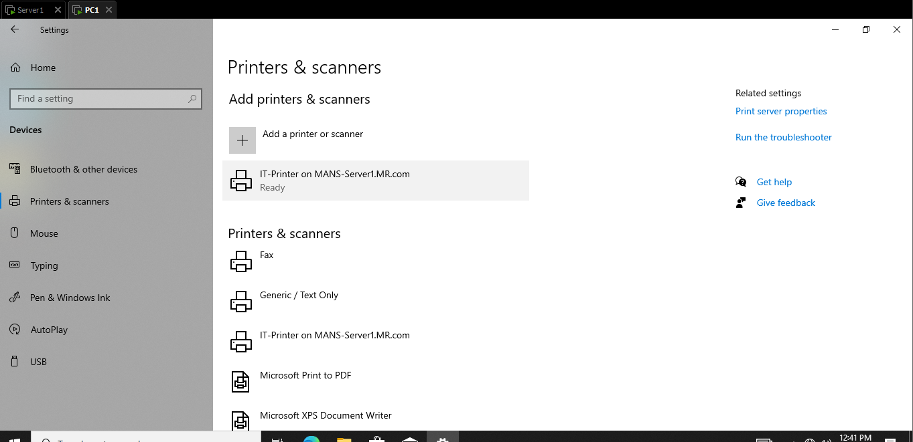

This screenshot confirms that the **IT-Printer** was successfully deployed to the client from `MANS-Server1.MR.com` via Group Policy printer deployment.

---

## 🗂️ File Sharing

Network shares were configured on `MANS-Server1` to support departmental file access.

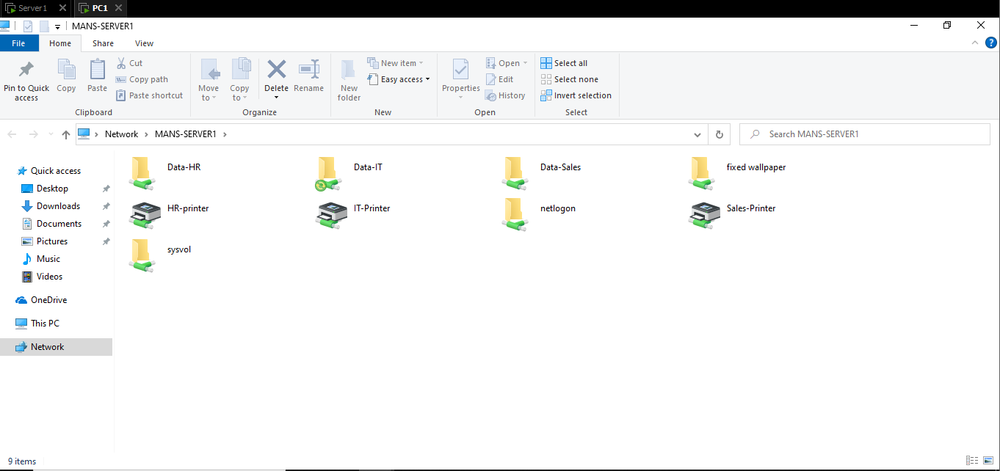

The server's shared resources include:

- `Data-HR`
- `Data-IT`
- `Data-Sales`
- `fixed wallpaper`
- `netlogon`
- `sysvol`
- `Printers`

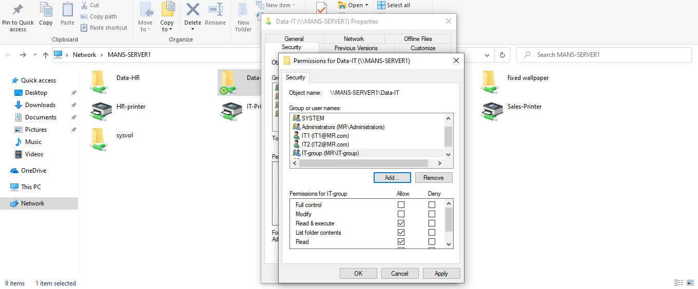

This screenshot confirms that the share `\\MANS-SERVER1\Data-IT` was successfully accessed from the client, verifying that network share permissions and connectivity are correctly configured.

---

## 🔐 NTFS Permissions


NTFS permissions on the `Data-IT` folder were configured for the IT organizational unit's users and group:

| Identity | Permissions |
|---|---|
| `IT1` | Read & execute, List folder contents, Read |
| `IT2` | Read & execute, List folder contents, Read |
| `IT-group` | Read & execute, List folder contents, Read |

---

## 🧪 Connectivity Test

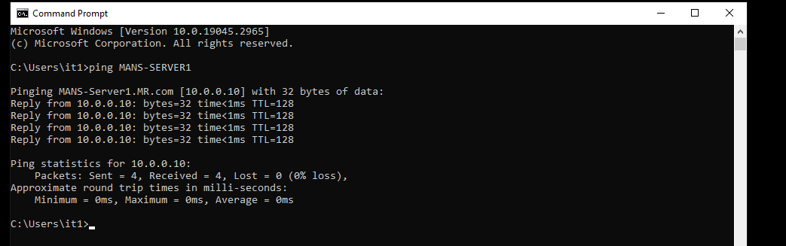

A final connectivity test was performed from the client to `MANS-Server1`, confirming successful client-to-server network communication.

> ✅ **Result:** 4/4 packets received · **0% packet loss** · 0 ms average response

---

## 🗂️ Screenshot Evidence Index

| No. | Screenshot | Purpose |
|---|---|---|
| 01 | `01-server-manager-dashboard.png` | Server Manager dashboard showing installed roles |
| 02 | `02-local-server-overview.png` | Local Server properties and domain membership |
| 03 | `03-adds-server-overview.png` | AD DS role overview |
| 04 | `04-active-directory-users-and-computers.png` | Active Directory Users and Computers console |
| 05 | `05-it-users-and-group.png` | IT users and security group |
| 06 | `06-dns-manager-overview.png` | DNS Manager overview |
| 07 | `07-dns-forward-lookup-zone.png` | MR.com forward lookup zone and host records |
| 08 | `08-dhcp-server-overview.png` | DHCP Server scope overview |
| 09 | `09-dhcp-address-leases.png` | Active DHCP address leases |
| 10 | `10-dhcp-scope-options.png` | DHCP scope options (router, DNS, domain) |
| 11 | `11-group-policy-management.png` | Group Policy Management console |
| 12 | `12-gpo-fixed-wallpaper-configuration.png` | Fixed wallpaper GPO configuration |
| 13 | `13-gpo-map-drive-hr-configuration.png` | HR mapped drive GPO configuration |
| 14 | `14-gpo-removable-disk-write-access.png` | Removable disk write access restriction GPO |
| 15 | `15-gpo-printer-hr-configuration.png` | HR printer deployment GPO |
| 16 | `16-gpo-printer-it-configuration.png` | IT printer deployment GPO |
| 17 | `17-gpo-printer-sales-configuration.png` | Sales printer deployment GPO |
| 18 | `18-nic-teaming-overview.png` | NIC Teaming configuration and status |
| 19 | `19-domain-joined-client.png` | Client domain membership verification |
| 20 | `20-client-network-configuration.png` | Client IP configuration (DHCP-assigned) |
| 21 | `21-client-dns-verification.png` | Client-side DNS resolution test (nslookup) |
| 22 | `22-gpo-result-user-settings.png` | gpresult user settings output |
| 23 | `23-gpo-result-applied-policies.png` | gpresult applied policies list |
| 24 | `24-mapped-drive-verification.png` | Mapped drive (Data-IT as G:) verification |
| 25 | `25-gpo-wallpaper-verification.png` | Client desktop wallpaper policy verification |
| 26 | `26-gpo-printer-verification.png` | IT printer deployment verification on client |
| 27 | `27-file-sharing-network-shares.png` | Server network shares overview |
| 28 | `28-data-it-share-verification.png` | Data-IT share access verification from client |
| 29 | `29-data-it-ntfs-permissions.png` | NTFS permissions on Data-IT folder |
| 30 | `30-client-server-connectivity-test.png` | Client-to-server connectivity test |

---

## 🧠 Skills Demonstrated

**Windows Server**
`Windows Server 2016` · `Server Administration` · `Active Directory` · `DNS` · `DHCP` · `Group Policy` · `File Services` · `NTFS Permissions` · `Printer Deployment` · `NIC Teaming`

**Active Directory**
`Domain Management` · `Organizational Units` · `User Management` · `Security Groups` · `Group Policy`

**Networking**
`IPv4` · `DHCP` · `DNS` · `Default Gateway` · `Client/Server Connectivity` · `NIC Teaming`

**Troubleshooting / Verification**
`nslookup` · `ping` · `gpresult` · `DHCP lease verification` · `DNS record verification` · `Network share verification` · `NTFS permission verification`

---

## 🎯 Project Objectives

- Build a Windows Server infrastructure environment
- Configure an Active Directory domain
- Manage users, groups, and organizational units
- Configure DNS for domain name resolution
- Configure DHCP for automatic client addressing
- Configure Group Policy for centralized client management
- Deploy departmental printers via Group Policy
- Configure mapped network drives via Group Policy
- Implement file sharing across departments
- Configure NTFS permissions for shared resources
- Configure NIC Teaming for network redundancy
- Join a Windows client to the domain
- Verify services and policies from the client
- Test client/server connectivity

---

## 🧰 Tools & Technologies

| Technology | Purpose |
|---|---|
| VMware Workstation | Virtualization platform hosting the lab environment |
| Windows Server 2016 | Domain controller and infrastructure server |
| Active Directory Domain Services | Domain, user, group, and OU management |
| DNS Server | Name resolution for the MR.com domain |
| DHCP Server | Automatic IP address assignment |
| Group Policy Management | Centralized client configuration and enforcement |
| File and Storage Services | Network file sharing |
| NIC Teaming | Network adapter redundancy and load balancing |
| Windows Client | Domain-joined endpoint for verification |
| Command Prompt | Client-side testing and diagnostics |
| nslookup | DNS resolution testing |
| gpresult | Group Policy application verification |
| ping | Network connectivity testing |

---

## 📁 Project Structure

```
Windows-Server-MCSA-Lab/
│
├── screenshots/
│   ├── 01-server-manager-dashboard.png
│   ├── 02-local-server-overview.png
│   ├── 03-adds-server-overview.png
│   ├── 04-active-directory-users-and-computers.png
│   ├── 05-it-users-and-group.png
│   ├── 06-dns-manager-overview.png
│   ├── 07-dns-forward-lookup-zone.png
│   ├── 08-dhcp-server-overview.png
│   ├── 09-dhcp-address-leases.png
│   ├── 10-dhcp-scope-options.png
│   ├── 11-group-policy-management.png
│   ├── 12-gpo-fixed-wallpaper-configuration.png
│   ├── 13-gpo-map-drive-hr-configuration.png
│   ├── 14-gpo-removable-disk-write-access.png
│   ├── 15-gpo-printer-hr-configuration.png
│   ├── 16-gpo-printer-it-configuration.png
│   ├── 17-gpo-printer-sales-configuration.png
│   ├── 18-nic-teaming-overview.png
│   ├── 19-domain-joined-client.png
│   ├── 20-client-network-configuration.png
│   ├── 21-client-dns-verification.png
│   ├── 22-gpo-result-user-settings.png
│   ├── 23-gpo-result-applied-policies.png
│   ├── 24-mapped-drive-verification.png
│   ├── 25-gpo-wallpaper-verification.png
│   ├── 26-gpo-printer-verification.png
│   ├── 27-file-sharing-network-shares.png
│   ├── 28-data-it-share-verification.png
│   ├── 29-data-it-ntfs-permissions.png
│   └── 30-client-server-connectivity-test.png
│
└── README.md
```

---

## 📚 Learning Outcomes

This project reflects hands-on, practical experience rather than theoretical knowledge alone. Through building and verifying this lab, the following experience was gained:

- Deploying and administering Windows Server infrastructure
- Administering Active Directory domains, users, groups, and organizational units
- Configuring and troubleshooting DNS and DHCP services
- Designing and deploying Group Policy for centralized client management
- Managing file shares and NTFS permissions for departmental access control
- Integrating Windows clients into a domain environment
- Verifying infrastructure services directly from the client side
- Troubleshooting and validating network services end-to-end
- Operating within an enterprise-style IT administration workflow

---

<div align="center">

## 👤 Author

### **Mohanad Mahmoud**

IT Support Engineer & IT Instructor

`Networking` · `Windows Server` · `Network Security`

📍 Mansoura, Egypt

[LinkedIn](https://www.linkedin.com/in/mohanad-mahmoud-it) · [GitHub](https://github.com/mohanad-mahmoud-it)

</div>
